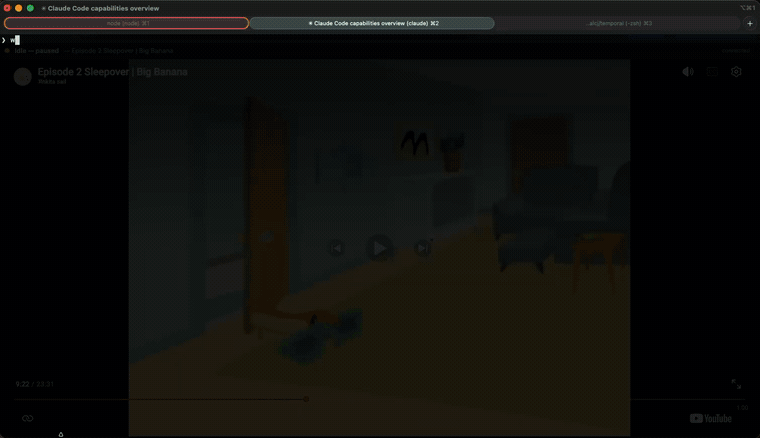

# 🐙 Oswald — While You Wait

Plays **Oswald** episodes from a YouTube playlist while your AI assistant is busy
working on a prompt, and **pauses the instant it stops** — picking up the next
time from the exact frame it left off.



> *Oswald plays while Claude works, and pauses — picking up right where it left off —
> the moment it's done. ([full-quality video](assets/demo.mp4))*

Ships as **both**:

- a **Claude Code plugin** (the "brain" — knows when the AI is working, via hooks), and
- a **VSCode extension** (a "screen" — shows the player in a side panel).

They share one tiny local control server, so you can use either or both together.

---

## How it works

```
  Claude Code hooks                 control server (localhost:8730)            player
 ┌───────────────────┐   POST /play  ┌──────────────────────────────┐  GET /state ┌──────────────┐
 │ UserPromptSubmit  │ ────────────▶ │ state = { playing, resume }  │ ◀────────── │ YouTube      │
 │ PreToolUse        │               │                              │             │ IFrame API   │
 │ Stop / Notify     │   POST /pause │  serves player.html          │ POST /position│ (browser or  │
 └───────────────────┘ ────────────▶ └──────────────────────────────┘ ──────────▶ │  VSCode panel)│
                                                                                    └──────────────┘
```

1. When you submit a prompt (or the AI runs a tool), the `UserPromptSubmit` /
   `PreToolUse` hooks POST `/play`. The control server flips `playing = true`.
2. The player page polls `/state` and, if it's `playing`, calls
   `player.playVideo()`.
3. When the AI finishes its turn (`Stop`) or pauses for input (`Notification`),
   the hook POSTs `/pause` → the page calls `player.pauseVideo()`.
4. **Resume:** the player never *stops*, it only *pauses*, and it continuously
   reports `{ playlistIndex, currentTime }` to `/position`. That position is
   saved to disk, so even across restarts it loads the next time at the same
   episode and timestamp.

> **One-time click:** browsers block auto-play with sound until you interact with
> the page once. The player shows a **"Click to arm ▶"** button. Click it once
> per session; after that everything is automatic.

---

## Folder layout

```
oswald-while-you-wait/
├── .claude-plugin/
│   └── marketplace.json          # lets you install the plugin with one command
├── player/                       # the shared core (source of truth)
│   ├── server.js                 # dependency-free Node control server
│   └── public/player.html        # YouTube IFrame player + sync logic
├── claude-plugin/                # the Claude Code plugin
│   ├── .claude-plugin/plugin.json
│   ├── hooks/
│   │   ├── hooks.json            # maps lifecycle events → play/pause scripts
│   │   ├── lib.sh                # shared helpers (ensure server, post commands)
│   │   ├── play.sh  pause.sh  ensure-server.sh
│   └── player/                   # bundled copy of the core (so hooks can start it)
└── vscode-extension/             # the VSCode extension
    ├── package.json
    ├── extension.js
    └── media/                    # bundled copy of the core
```

---

## Requirements

- **Node.js** on your `PATH` (used to run the control server). Check: `node -v`.
- A **YouTube playlist** — the default is the Oswald list
  `PLJOUQWZHQRPvbWKl4YgrEcs7kazppKoFR`. Change it with the `OSWALD_PLAYLIST`
  env var (plugin) or the `oswald.playlistId` setting (VSCode).

---

## Install — Claude Code plugin

### Option A: as a plugin (recommended)

From the repo's parent folder, in Claude Code:

```
/plugin marketplace add ./oswald-while-you-wait
/plugin install oswald-while-you-wait@oswald-marketplace
```

Restart Claude Code (or run `/reload-plugins`). On your next prompt, the player
opens in your browser and starts playing while Claude works.

### Option B: register the hooks directly (no plugin packaging)

If you'd rather not use the marketplace flow, add this to
`~/.claude/settings.json`, replacing `ABS_PATH` with the absolute path to the
`claude-plugin` folder:

```json
{
  "hooks": {
    "SessionStart":     [{ "hooks": [{ "type": "command", "command": "bash \"ABS_PATH/hooks/ensure-server.sh\"" }] }],
    "UserPromptSubmit": [{ "hooks": [{ "type": "command", "command": "bash \"ABS_PATH/hooks/play.sh\"" }] }],
    "PreToolUse":       [{ "hooks": [{ "type": "command", "command": "bash \"ABS_PATH/hooks/play.sh\"" }] }],
    "Stop":             [{ "hooks": [{ "type": "command", "command": "bash \"ABS_PATH/hooks/pause.sh\"" }] }],
    "Notification":     [{ "hooks": [{ "type": "command", "command": "bash \"ABS_PATH/hooks/pause.sh\"" }] }]
  }
}
```

> When running outside the plugin system, the scripts fall back to walking up
> from their own location to find `player/server.js`, so they still work.

---

## Install — VSCode extension

For quick local use (development host):

```bash
cd vscode-extension
# open this folder in VSCode and press F5 to launch an Extension Development Host
```

To package and install a `.vsix`:

```bash
npm install -g @vscode/vsce
cd vscode-extension
vsce package
code --install-extension oswald-while-you-wait-1.0.0.vsix
```

Then use the command palette:

- **Oswald: Show Player Panel** — opens the video in a side panel.
- **Oswald: Play / Pause / Toggle** — manual control (handy if you're *not*
  driving it from Claude Code).
- **Oswald: Start / Stop Control Server**.

If you use the VSCode panel as your display, set `OSWALD_OPEN_BROWSER=0` for the
Claude Code plugin so it doesn't also pop a browser tab.

---

## Using both together (the hybrid)

- The **Claude Code plugin** decides *when* to play/pause (it sees the AI's
  lifecycle through hooks).
- The **VSCode extension** is just a window onto the same server.

Run Claude Code in the VSCode integrated terminal, open the Oswald panel, and the
panel will play/pause automatically as Claude works — because both talk to the
same `localhost:8730`.

---

## Configuration

| What            | Plugin (env var)        | VSCode (setting)        | Default |
|-----------------|-------------------------|-------------------------|---------|
| Port            | `OSWALD_PORT`           | `oswald.port`           | `8730`  |
| Playlist ID     | `OSWALD_PLAYLIST`       | `oswald.playlistId`     | Oswald list |
| Auto-open tab   | `OSWALD_OPEN_BROWSER`   | (panel instead)         | `1`     |
| State directory | `OSWALD_DATA_DIR`       | —                       | `~/.oswald-while-you-wait` |

Keep the **port the same** on both sides so they share state.

---

## Run the server by hand (for testing)

```bash
cd player
OSWALD_PORT=8730 node server.js
# then open http://localhost:8730
# fake the AI working:   curl -X POST http://localhost:8730/play
# fake the AI stopping:  curl -X POST http://localhost:8730/pause
```

---

## Turning it on and off

There are three levels, from lightest to heaviest:

**1. Pause right now (leave everything installed):**

```bash
bash scripts/oswald.sh pause      # or just hit pause in the player itself
bash scripts/oswald.sh play       # resume
```

**2. Disable the automation (server stays, hooks stop auto-playing):**

```bash
bash scripts/oswald.sh off        # creates ~/.oswald-while-you-wait/disabled and pauses
bash scripts/oswald.sh on         # removes the flag, auto-play resumes
bash scripts/oswald.sh status     # show switch + server state
```

While "off", the `play.sh` / `pause.sh` / `ensure-server.sh` hooks all exit
immediately as no-ops. You can also set `OSWALD_DISABLED=1` in your environment
for the same effect. (This is the quickest way to silence it without touching
your plugin config.)

**3. Fully off (stop loading it at all):**

- Claude Code: `/plugin` → disable or uninstall `oswald-while-you-wait`
  (or remove the hook block from `~/.claude/settings.json`).
- VSCode: disable/uninstall the extension, or run **Oswald: Stop Control Server**.

## Testing

A self-contained end-to-end test spins up the server on a throwaway port and
asserts play / pause / resume / restart-resume / kill-switch behaviour:

```bash
bash scripts/test.sh
# expect: PASSED: 13 / FAILED: 0
```

It needs nothing but Node and `curl`, and cleans up after itself.

## Notes & limitations

- **Audio policy:** the one-time "arm" click is required by every browser; there
  is no way around it programmatically.
- **Content:** this plays a YouTube playlist you point it at — it does not
  download or redistribute anything. Swap in any playlist via the config above.
- **Mid-turn permission prompts:** a `Notification` pauses; the next tool call's
  `PreToolUse` resumes — so playback follows the AI through multi-step turns.
- **No npm dependencies** in the server, so it starts instantly with plain Node.
```
